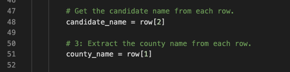

# PyPoll Python Challenge

*****
*****

* By: Tyler Sojka
* September-October 2020 
* Data Visualizations

*****
*****

## Election Audit Overview
A Colorado Board of Elections employee has given you the following tasks to complete the election audit of a recent local congressional election.

1. Calculate the total number of votes cast.
2. Get a complete list of counties in the election.
3. Calculate the total number of votes in each county.
4. Calculate the percentage of votes for each county.
5. Which county had the largest voter turnout.
6. Get a complete list of candidates who received votes.
7. Calculate the total number of votes each candidate received.
8. Calculate the percentage of votes each candidate won.
9. Determine the winner of the election based on popular vote.

## Resources
- Data Source: election_results.csv
- Software: Python 3.8.5, Visual Studio Code 1.49.1

## Election Audit Results
 The analysis of the election shows that:
- There were 369,711 votes cast in the election.
- The counties in the election were:
  - Jefferson County
    - 10.5% of the votes with 38,855 votes
  - Denver County
    - 82.8% of the votes with 306,055 votes
  - Arapahoe County
    - 6.7% of the votes with 24,801 votes
- <b>County with the largest voter turnout:
  - Denver County with 82.8% of the votes with 306,055 votes </b>
- The candidates were:
  - Charles Casper Stockham
    - 23.0% of the votes with 85,213 total votes.
  - Diana DeGette
    - 73.8% of the votes with 272,892 total votes.
  - Raymon Anthony Doane
    - 3.1% of the votes with 11,606 total votes.
- <b>Winner of the election:
  - Diana DeGette with 73.8% of the votes with 272,892 total votes. </b>

## Election Audit Summary
While this script was made for the given election data, with some minor changes, it could be used for any election. Any election data set with the format of [ballot number, county name, candidate] could be imported into the script and run with no modifications other than changing the election data file. Any file in a format similar to the one used in this script could also be modified to fit the script as is, ie, re-arranging columns, deleating columns not used in this script, etc. If changing the data file is not an option, the script itself could be altered in slight ways to accomidate different data file. The index values in lines 48 and 51  could be changed to allow for different columns to be used to gather the county and candidate data. If other metrics were desired, any of the variables could be changed, and referenced throughought the script as well. 
